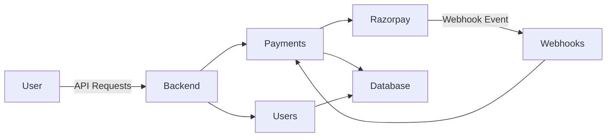
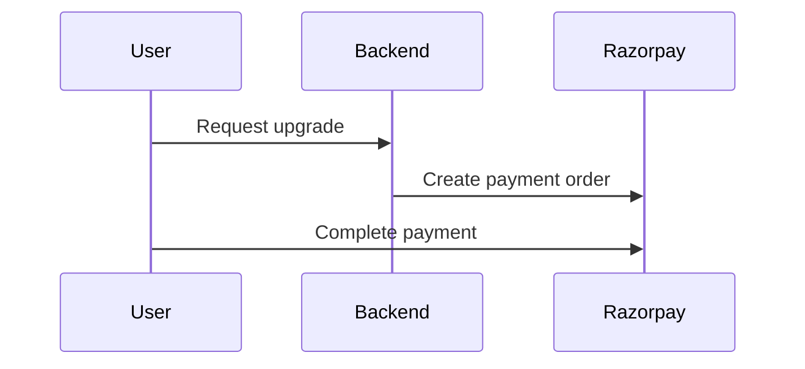
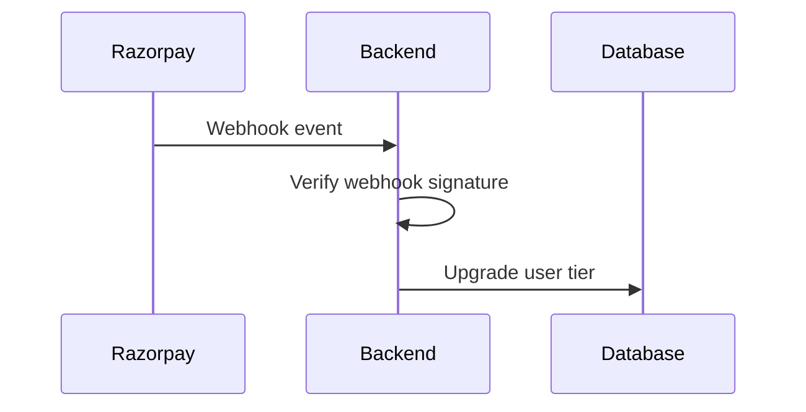

# Consumer Economy Management System

A **subscription-based backend platform** for managing users, payments, and automated membership tiers.

The system integrates the **Razorpay payment gateway** with **secure webhook verification** to automatically upgrade user subscriptions after successful payments.

This project demonstrates backend engineering concepts including:

* REST API development
* Payment gateway integration
* Webhook security validation
* Subscription tier management
* Scalable backend architecture
* Asynchronous deployment using Daphne

---

# System Architecture



### Architecture Overview

1. The user interacts with the backend via REST APIs.
2. Payment requests are sent to Razorpay.
3. Razorpay processes the payment.
4. Razorpay sends a webhook event after payment completion.
5. The backend verifies the webhook signature.
6. The user's membership tier is automatically upgraded.

---
## Payment Workflow



## Webhook Processing



---

# Features

* Tier-based subscription system
* Secure payment integration with Razorpay
* Webhook signature verification
* RESTful API architecture
* Membership tier automation
* PostgreSQL database support
* Asynchronous deployment support with Daphne
* Email services for password reset and notifications
* Modular Django app architecture

---

# Technology Stack

| Technology            | Purpose           |
| --------------------- | ----------------- |
| Django                | Backend framework |
| Django REST Framework | API development   |
| PostgreSQL            | Database          |
| Razorpay              | Payment gateway   |
| Daphne                | ASGI deployment   |
| Postman               | API testing       |

---

# Project Structure

```
consumer-economy-system/
│
├── common/
│   Shared utilities, helper functions, and reusable modules.
│
├── core/
│   Main Django project configuration:
│   - settings.py
│   - urls.py
│   - asgi.py
│
├── users/
│   User authentication and membership management.
│
├── payments/
│   Payment processing logic including Razorpay integration.
│
├── webhooks/
│   Webhook handlers that process Razorpay payment events.
│
├── emails/
│   Email services including password reset and notifications.
│
├── manage.py
├── requirements.txt
└── README.md
```

---

# API Endpoints
Authentication

| Method | Endpoint                   | Description                          |
| ------ | -------------------------- | ------------------------------------ |
| POST   | `/api/auth/register/`      | Register a new user                  |
| POST   | `/api/auth/login/`         | Obtain JWT access and refresh tokens |
| POST   | `/api/auth/logout/`        | Logout user and invalidate session   |
| POST   | `/api/auth/verify/`        | Verify user email                    |
| POST   | `/api/auth/token/refresh/` | Refresh JWT access token             |


User Profile

| Method | Endpoint                        | Description                  |
| ------ | ------------------------------- | ---------------------------- |
| GET    | `/api/profile/`                 | Retrieve user profile        |
| POST   | `/api/profile/password/reset/`  | Reset password               |
| POST   | `/api/profile/password/forgot/` | Request password reset email |


Subscription & Payments

| Method | Endpoint                         | Description                                |
| ------ | -------------------------------- | ------------------------------------------ |
| POST   | `/api/payments/start-upgrade/`   | Start membership upgrade process           |
| POST   | `/api/payments/confirm-payment/` | Confirm payment after Razorpay transaction |


---

# Webhook Security

Webhook verification ensures that payment events are authentic.

The backend performs:

1. Receive webhook request from Razorpay
2. Extract `X-Razorpay-Signature`
3. Generate HMAC using the webhook secret
4. Compare signatures
5. Accept or reject the request

This prevents **fake payment events and subscription abuse**.

---

# Installation

## Clone Repository

```bash
git clone https://github.com/ashpb07/Consumer-Economy-Management-System.git
cd consumer-economy-system
```

---

## Create Virtual Environment

```bash
python -m venv venv
source venv/bin/activate
```

Windows:

```bash
venv\Scripts\activate
```

---

## Install Dependencies

```bash
pip install -r requirements.txt
```

---

## Configure Environment Variables

Create a `.env` file.

```
SECRET_KEY=your_django_secret
DEBUG=True

DB_NAME=postgres
DB_USER=postgres
DB_PASSWORD=password
DB_HOST=localhost

RAZORPAY_KEY_ID=your_key
RAZORPAY_SECRET=your_secret
RAZORPAY_WEBHOOK_SECRET=your_webhook_secret
```

---

## Run Database Migrations

```bash
python manage.py migrate
```

---

## Run Development Server

```bash
python manage.py runserver
```

---

# Running with Daphne

Daphne allows the application to run with **ASGI support**.

```
daphne core.asgi:application
```

---

# Example Membership Tiers

| Tier     | Features         |
| -------- | ---------------- |
| Free     | Basic access     |
| Gold     | Premium features |
| Platinum | Full access      |

---

# Future Improvements

* JWT authentication
* Rate limiting
* API documentation with Swagger
* Docker containerization
* Admin dashboard for subscription analytics
* Monitoring and logging support

---

# License

MIT License

Copyright (c) 2025 Anish G Prabhu

Permission is hereby granted, free of charge, to any person obtaining a copy of this software and associated documentation files to deal in the Software without restriction.

THE SOFTWARE IS PROVIDED "AS IS", WITHOUT WARRANTY OF ANY KIND.

---

# Author

**Anish G Prabhu**

Cybersecurity Engineering Student
Backend Developer | Security Enthusiast

GitHub: https://github.com/ashpb07
