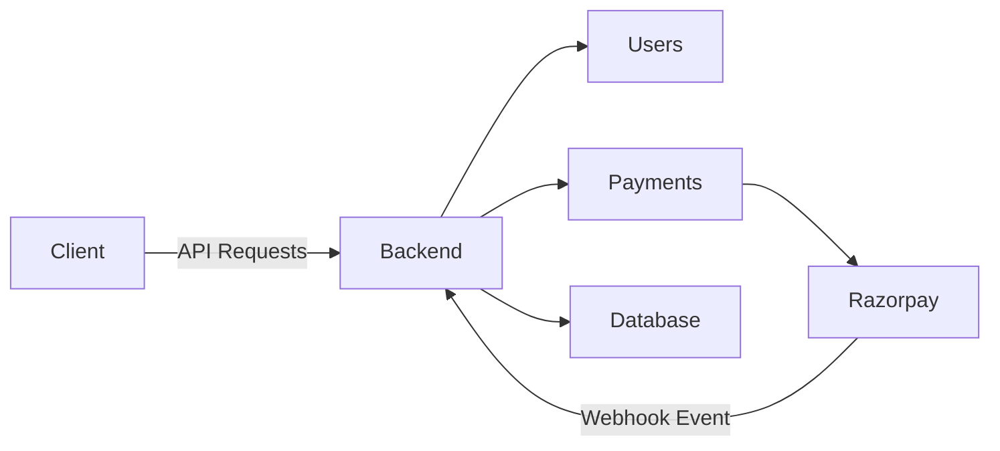
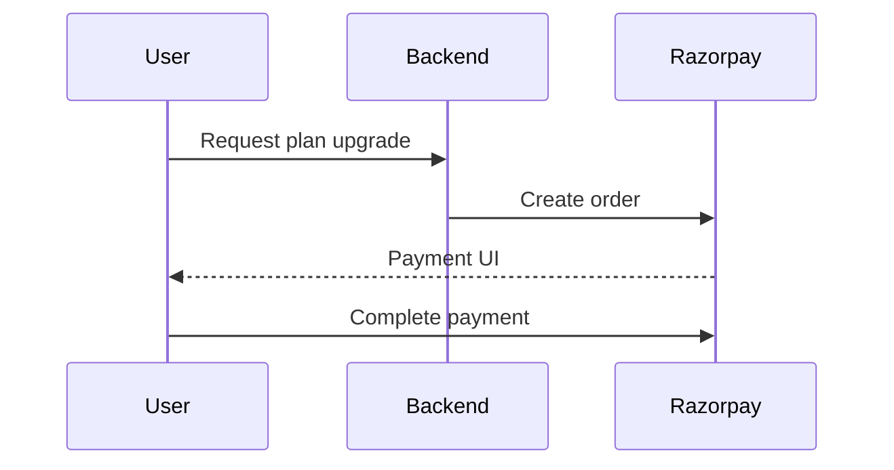
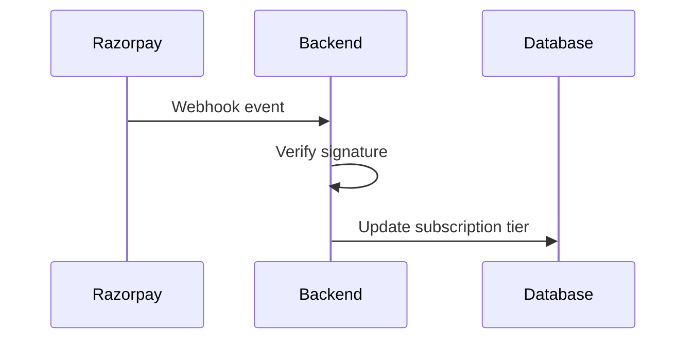
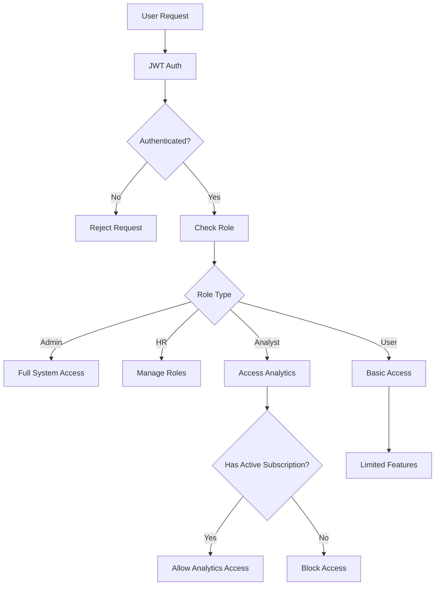

# Consumer Economy Management System

A **subscription-based backend platform** for managing users, payments, and automated membership tiers.

The system integrates the **Razorpay payment gateway** with **secure webhook verification** to automatically upgrade user subscriptions after successful payments.

This project demonstrates backend engineering concepts including:

* REST API development
* Payment gateway integration
* Webhook security validation
* Subscription tier management
* Scalable backend architecture
* Asynchronous deployment using Daphne

---

---
##  Table of Contents

- [Overview](#overview)
- [Features](#-features)
- [System Architecture](#-system-architecture)
- [RBAC System](#-rbac-system)
- [Payment Workflow](#-payment-workflow)
- [Webhook Processing](#-webhook-processing)
- [API Endpoints](#-api-endpoints)
- [Project Structure](#-project-structure)
- [Installation](#-installation)
- [Testing](#-testing)
- [Future Improvements](#-future-improvements)
- [License](#-license)
- [Author](#-author)
---

# System Architecture



### Architecture Overview

1. The user interacts with the backend via REST APIs.
2. Payment requests are sent to Razorpay.
3. Razorpay processes the payment.
4. Razorpay sends a webhook event after payment completion.
5. The backend verifies the webhook signature.
6. The user's membership tier is automatically upgraded.

---
## Payment Workflow



## Webhook Processing



## RBAC Permission Flow



---

#  Features

###  Authentication & Security
- JWT-based authentication system
- Secure password reset and email verification
- Role-based access control (RBAC)
- Protected APIs with fine-grained permissions

---

###  Hierarchical RBAC System
- Multi-level role hierarchy: **Admin → HR → Analyst → User**
- Admin can assign HR roles
- HR can assign Analyst roles
- Role-based endpoint access enforcement

---

###  Subscription & Payment System
- Tier-based subscription plans (Free, Gold, Platinum)
- Razorpay integration (payment-ready architecture)
- Secure webhook signature verification (HMAC)
- Automated subscription activation after successful payment
- Mock payment support for testing environments

---

###  Analytics & Logging
- Middleware-based request logging system
- Tracks user activity, endpoints, status codes, and IP addresses
- Paginated logs API for scalable data retrieval
- Analytics dashboard with traffic insights and usage metrics

---

###  Backend Architecture
- Modular Django app structure (users, payments, analytics, common)
- Clean separation of concerns
- Scalable RESTful API design
- Environment-based configuration for security

---

###  Infrastructure & Deployment
- PostgreSQL database support
- ASGI deployment with Daphne
- Production-ready configuration
- Secure handling of environment variables

---

###  Additional Features
- Email services for password reset and notifications
- Token-based authentication flows
- API-first (headless backend) architecture
---

# Technology Stack

| Technology            | Purpose           |
| --------------------- | ----------------- |
| Django                | Backend framework |
| Django REST Framework | API development   |
| PostgreSQL            | Database          |
| Razorpay              | Payment gateway   |
| Daphne                | ASGI deployment   |
| Postman               | API testing       |

---

# Project Structure

```
consumer-economy-system/
│
├── common/
│   Shared utilities, helper functions, and reusable modules.
│
├── core/
│   Main Django project configuration:
│   - settings.py
│   - urls.py
│   - asgi.py
│
├── users/
│   User authentication and membership management.
│
├── payments/
│   Payment processing logic including Razorpay integration.
│
├── webhooks/
│   Webhook handlers that process Razorpay payment events.
│
├── emails/
│   Email services including password reset and notifications.
│
├── manage.py
├── requirements.txt
└── README.md
```

---

# API Endpoints
Authentication
| Method | Endpoint | Description |
|:------:|----------|-------------|
| POST | /api/users/register/ | Register new user |
| POST | /api/users/login/ | Obtain JWT tokens |
| POST | /api/users/logout/ | Logout user |
| POST | /api/users/refresh/ | Refresh access token |
| POST | /api/users/verify/ | Verify user email |


User Profile
| Method | Endpoint | Description |
|:------:|----------|-------------|
| GET | /api/users/profile/ | Retrieve user profile |
| POST | /api/users/profile/password/reset/ | Reset password |
| POST | /api/users/profile/password/forgot/ | Request password reset email |

Role Management (RBAC)
| Method | Endpoint | Description |
|:------:|----------|-------------|
| POST | /api/users/assign-role/ | Assign role (Admin → HR → Analyst) |

Subscription & Payments

| Method | Endpoint | Description |
|:------:|----------|-------------|
| POST | /api/payments/create/ | Create Razorpay order |
| POST | /api/payments/verify/ | Verify payment signature |
| POST | /api/payments/webhook/ | Handle Razorpay webhook |
| POST | /api/payments/mock-confirm/ | Mock payment success (testing) |

Analytics
| Method | Endpoint | Description |
|:------:|----------|-------------|
| GET | /api/analytics/dashboard/ | Analytics dashboard data |
| GET | /api/analytics/logs/?page=1 | Paginated logs |


Testing Notes
| Item | Details |
|------|--------|
| Authentication | JWT (Bearer Token) |
| Tool Used | Postman |
| Header Required | Authorization: Bearer <access_token> |


---


---

# Installation

## Clone Repository

```bash
git clone https://github.com/ashpb07/Consumer-Economy-Management-System.git
cd consumer-economy-system
```

---

## Create Virtual Environment

```bash
python -m venv venv
source venv/bin/activate
```

Windows:

```bash
venv\Scripts\activate
```

---

## Install Dependencies

```bash
pip install -r requirements.txt
```

---

## Configure Environment Variables

Create a `.env` file.

```
SECRET_KEY=your_django_secret
DEBUG=True

DB_NAME=postgres
DB_USER=postgres
DB_PASSWORD=password
DB_HOST=localhost

RAZORPAY_KEY_ID=your_key
RAZORPAY_SECRET=your_secret
RAZORPAY_WEBHOOK_SECRET=your_webhook_secret
```

---

## Run Database Migrations

```bash
python manage.py migrate
```

---

## Run Development Server

```bash
python manage.py runserver
```

---

# Running with Daphne

Daphne allows the application to run with **ASGI support**.

```
daphne core.asgi:application
```

---

# Example Membership Tiers

| Tier     | Features         |
| -------- | ---------------- |
| Free     | Basic access     |
| Gold     | Premium features |
| Platinum | Full access      |

---
#  Future Improvements

- Add API rate limiting and enhanced security controls  
- Integrate Swagger/OpenAPI documentation  
- Enable full Razorpay production integration  
- Implement real-time analytics and performance tracking  
- Add Docker support and CI/CD pipeline  
- Introduce Redis caching for performance optimization  
- Improve monitoring and logging (Sentry / Prometheus)  

---
# Author

**Anish G Prabhu**

Cybersecurity Engineering Student
Backend Developer | Security Enthusiast

GitHub: https://github.com/ashpb07
